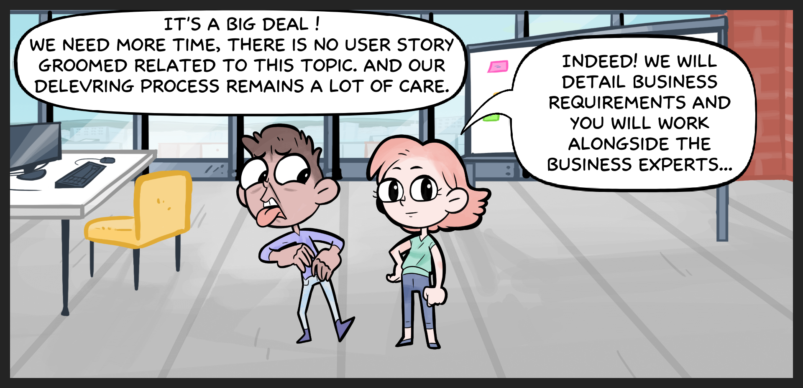

## Business requirements
The aim of this kata is to implement a shopping system for black Friday. 7 days left,we don’t have 
enough time. 

Customer will express his needs and we will work alongside the business experts to get the requirements. 
Therefor, We have to find a best manner to proof our development credibility and by using craftsmanship best practices.

Considering our job is to implement the heart of the application, means the domain to 
manipulate and the business logic behind.

We cannot negotiate the quality, we have to write the tests before production code.

## Acceptance criteria

> Adding articles to my basket

    scenario 1
- As a User I can add to my basket an article
- When I select an "Adidas" sneakers with price 100€
- Then the system will calculate the amount to pay (amount of basket) 100€

    scenario 2
- As a User I can add to my basket two articles
- When I select Quantity 2 of "Adidas" sneakers with price 100€
- Then the system will calculate the amount to pay: 200€

    scenario 3
- As a User I can add to my basket two articles
- When I select 1 Quantity of "Nike" sneakers with price 99€
- And a Shirt "TOMMY HILFIGER" with size M with price 51€
- Then the system will calculate the amount to pay: 150€
